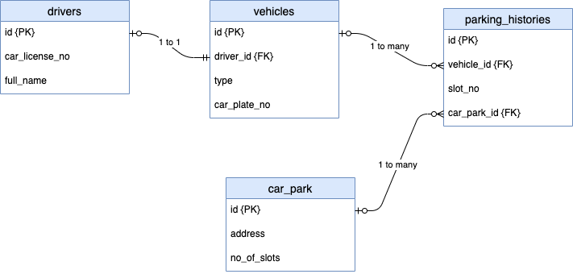

# Introduction to PostgreSQL: Assignment

## Brief

Refer to the ERD (same as lesson).



In the lesson, you have finished:
1. Create drivers table
2. Create vehicles table
3. Create one-to-one relationship between drivers and vehicles.

In this assignment, you will continue to work on:
1. Create car_park table.
2. Create parking_histories table.
3. Create foreign keys to associate:
    - one car_park has zero to many parking_histories
    - one vehicle has zero to many parking-histories

Demonstrate your understanding by inserting SQL Queries related to table creation and foreign key creation below.

You may use `pg_dump` to export your database and include the file in this repository.


```sql
// 
-- Create table for vehicles
CREATE TABLE vehicles (
  id serial primary key,
  type varchar(50) not null,
  car_plate_no varchar(10) not null
);
-- To insert Multiple Data to table
INSERT INTO vehicles(type, car_plate_no) VALUES ('Truck', 'SHA1234'),('Sedan', 'SHA2222');

-- New table for drivers
CREATE TABLE drivers (
  id serial primary key,
  car_license_number VARCHAR(20) not null,
  full_name varchar(100) not null
);
-- To insert Multiple Data to drivers
INSERT INTO drivers(car_license_number, full_name) VALUES ('car1', 'John'), ('car2', 'Peter');

-- Add column to drivers (add foreign key in vehicle table)
ALTER TABLE "vehicles" ADD column driver_id int;

-- Update data in vehicles
update "vehicles" set "driver_id" = 1 where “id” = 1;
update "vehicles" set "driver_id" = 2 where “id” = 2;

-- Add column to drivers (add foreign key in vehicle table)
ALTER TABLE "vehicles" ADD column driver_id int;

-- Update table add foreign key in vehicles
ALTER TABLE vehicles ADD constraint fk_driver_id foreign key (driver_id) references drivers(id);

-- New table for parking_histories
CREATE TABLE parking_histories (
    id serial primary key,
    vehicle_id int,
    slot_no VARCHAR(20) not null,
    car_park_id VARCHAR(20) not null
);
-- To insert Multiple Data to parking_histories
INSERT INTO parking_histories(vehicle_id, slot_no, car_park_id) VALUES (1, 'A1', 'carpark_a'), (2, 'A2', 'carpark_b');

-- Update table add foreign key in parking_histories
ALTER TABLE "parking_histories" ADD constraint fk_vehicle_id foreign key (vehicle_id) references vehicles(id);

CREATE TABLE car_park (
    id serial primary key,
    address VARCHAR(30) not null,
    no_of_slots int
);
INSERT INTO car_park(address, no_of_slots) VALUES ('ang mo kio', 10), ('toa payoh', 11), ('bishan', 12), ('novena', 12);
ALTER TABLE "car_park" ADD constraint fk_parking_histories_id foreign key (car_park_id) references car_park(id);
//
```

## Submission Guidelines

- Cite any relevant sources consulted during your research
- Solve the problems using your own code
- Do not copy and paste solutions from the source material
- Submit your assignment to black board.
